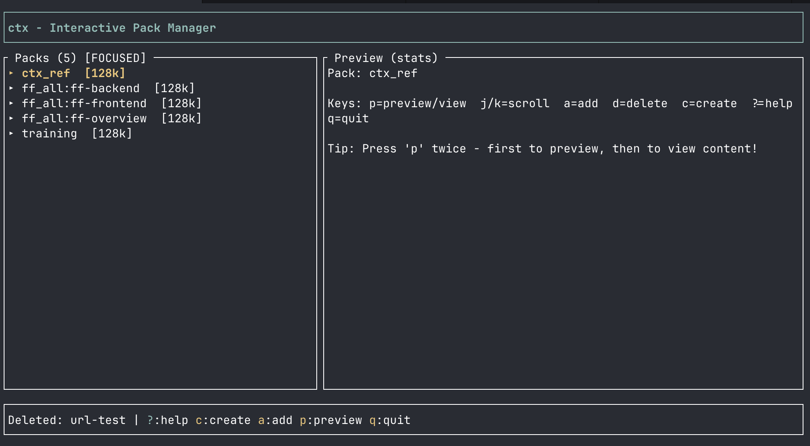
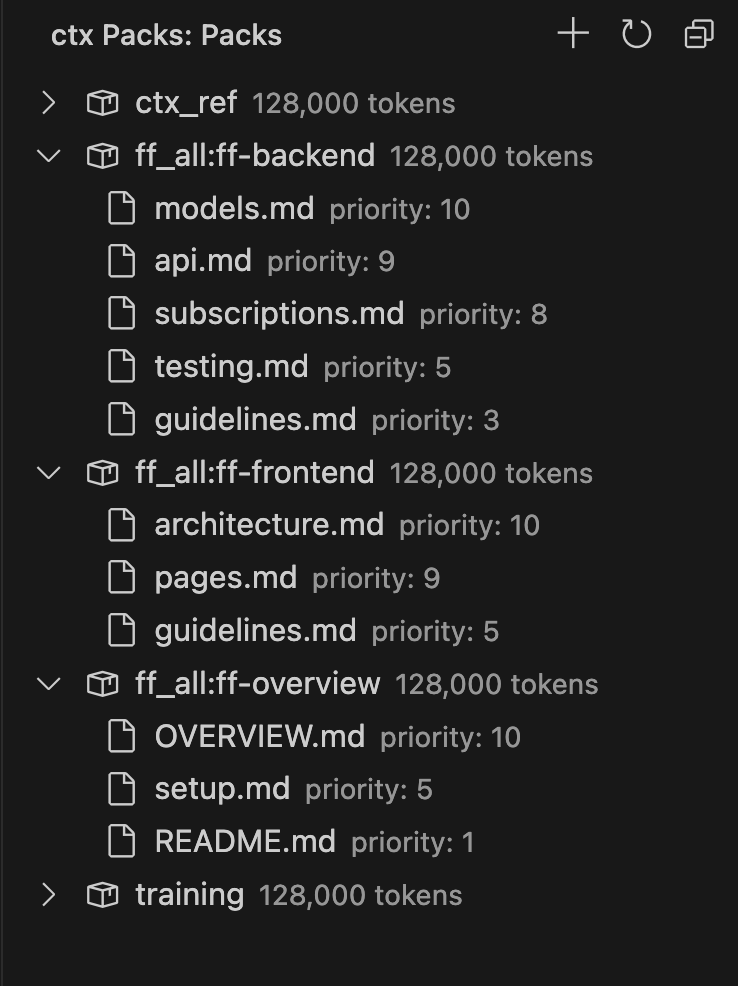

# ctx

**Curate what your LLM sees.** 
Create reusable context packs and load them into Claude Code, Cursor, or any MCP-compatible tool.

```bash
ctx create auth-refactor
ctx add auth-refactor file:src/auth.rs --priority 10
ctx add auth-refactor 'glob:src/middleware/*.rs'
ctx add auth-refactor 'git:diff --base=main'

# Load into Claude Code via MCP
claude mcp add ctx -- ctx mcp --stdio
# OR using the install command
ctx install claude
# "Load the auth-refactor pack"
```



## Why ctx?

LLMs discover files, but they can't read your mind. ctx lets you:

- **Curate context** for specific tasks - refactors, reviews, features
- **Control tokens** with budgets and priorities
- **Share setups** via `ctx.toml` in version control
- **Auto-redact secrets** before they reach the LLM
- **Find related files** via git history and imports

## Install

| Method | Command |
|--------|---------|
| **Homebrew** | `brew install vladisov/ctx/ctx` |
| **Cargo** | `cargo install ctx-cli` |
| **VS Code** | Search "ctx" in marketplace or `code --install-extension vladisov.vscode-ctx` |
| **Binary** | Download from [releases](https://github.com/vladisov/ctx/releases) |

## Quick Start

```bash
# One-off: file + related files → clipboard
ctx @ src/auth.rs

# Create a reusable pack
ctx create my-feature
ctx add my-feature file:src/main.rs
ctx add my-feature 'glob:src/**/*.rs'
ctx add my-feature 'text:Focus on error handling'

# Preview and copy
ctx preview my-feature
ctx cp my-feature

# Share with team
ctx init && ctx save my-feature
git add ctx.toml && git commit -m "Add context pack"
```

## Source Types

```bash
ctx add pack file:src/main.rs                    # Single file
ctx add pack file:src/main.rs --start 10 --end 50  # Line range
ctx add pack 'glob:src/**/*.rs'                  # Glob pattern
ctx add pack 'git:diff --base=main'              # Git diff
ctx add pack 'url:https://docs.rs/tokio'         # Web page
ctx add pack 'text:Use async/await'              # Inline text
```

## VS Code Extension



[**Install from Marketplace**](https://marketplace.visualstudio.com/items?itemName=vladisov.vscode-ctx)

Full-featured extension for managing context packs visually.

**Features:**
- Sidebar pack browser with token counts
- Right-click → Add to Pack on files/selections
- Related file suggestions (Cmd+Shift+C S)
- Live preview with rendered content
- ctx.toml sync notifications

**Keybindings:**

| Shortcut | Action |
|----------|--------|
| `Cmd+Shift+C A` | Add selection to pack |
| `Cmd+Shift+C S` | Show related files |

**Settings:**

| Setting | Default | Description |
|---------|---------|-------------|
| `ctx.server.port` | `17373` | MCP server port |
| `ctx.server.autoStart` | `true` | Auto-start server |
| `ctx.defaultTokenBudget` | `128000` | Default budget for new packs |

## MCP Integration

Connect ctx to Claude Code or any MCP client:

```bash
# Claude Code (stdio)
claude mcp add ctx -- ctx mcp --stdio

# Other clients (HTTP)
ctx mcp --port 17373
```

Then ask your LLM:
- "List my ctx packs"
- "Preview the auth pack"
- "Load the auth pack" (injects context directly)

## REST API

```bash
ctx mcp --port 17373

GET  /api/packs                    # List packs
POST /api/packs                    # Create pack
GET  /api/packs/:name              # Get pack details
GET  /api/packs/:name/render       # Get rendered content
POST /api/packs/:name/artifacts    # Add artifact
GET  /api/suggest?file=<path>      # Get related files
```

Use for ChatGPT Actions, scripts, or CI/CD.

## Commands

| Command | Description |
|---------|-------------|
| `ctx @` | Quick context → clipboard |
| `ctx create` | Create pack |
| `ctx add` | Add source to pack |
| `ctx rm` | Remove artifact |
| `ctx ls` | List packs |
| `ctx show` | Show pack details |
| `ctx preview` | Preview with tokens |
| `ctx cp` | Copy to clipboard |
| `ctx delete` | Delete pack |
| `ctx suggest` | Related file suggestions |
| `ctx lint` | Find missing deps |
| `ctx init` | Create ctx.toml |
| `ctx install` | Install integrations (claude, opencode) |
| `ctx sync` | Import from ctx.toml |
| `ctx save` | Export to ctx.toml |
| `ctx mcp` | Start MCP server |
| `ctx ui` | Terminal UI |

## Configuration

**Global** (`~/.config/ctx/config.toml`):
```toml
budget_tokens = 128000

[denylist]
patterns = ["**/.env*", "**/secrets/**"]
```

**Project** (`ctx.toml`):
```toml
[packs.auth-feature]
budget = 80000
artifacts = [
    { source = "file:src/auth.rs", priority = 10 },
    { source = "glob:tests/auth/**/*.rs" },
]
```

## Development

```bash
git clone https://github.com/vladisov/ctx
cd ctx
cargo build --release
cargo test --workspace

# VS Code extension
cd vscode-ctx && npm install && npm run compile
```

## License

MIT OR Apache-2.0
